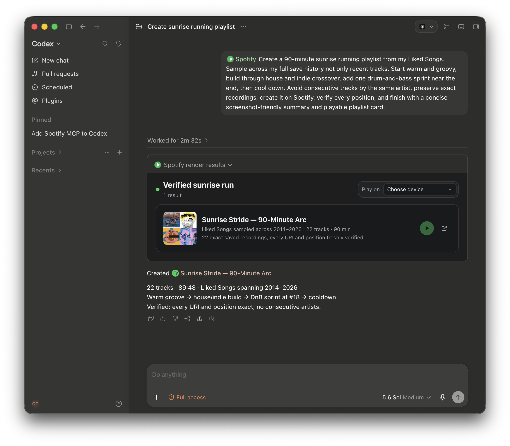
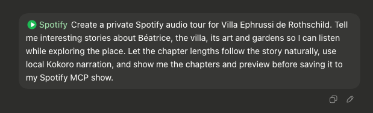
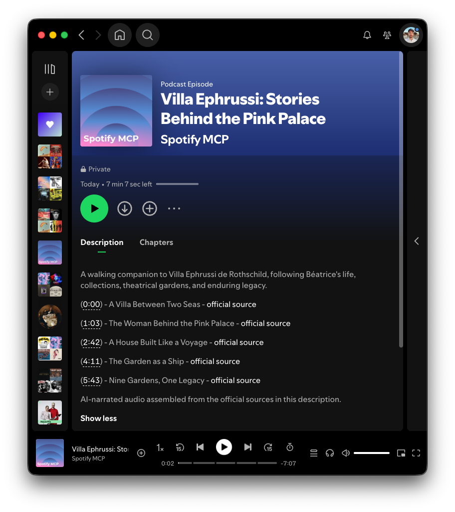
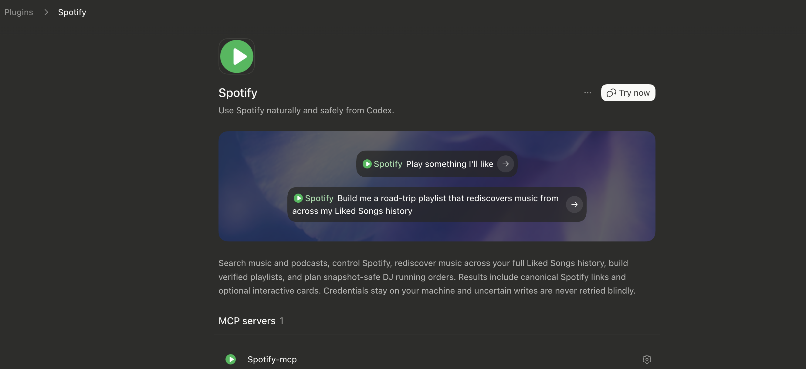

<div align="center">

# 🎵 Spotify for Codex

**Ask Codex to play music, find old favourites, build playlists, or plan a DJ set.**


[](LICENSE)


[Get started](#get-started) · [See what you can ask](#what-can-i-ask) ·
[Setup guide](docs/setup.md)

</div>

> [!NOTE]
> This open-source project has no connection to Spotify AB. Use it in line with the
> [Spotify Developer Policy](https://developer.spotify.com/policy).

## ✨ Rich Spotify results, inside Codex

Verified tracks, albums, artists, and playlists can appear as compact cards inside Codex. Choose a
Spotify Connect device, start the exact result, or open its canonical Spotify page.

<p align="center">
  
</p>

<sub>A real Codex result: a 90-minute playlist created from Liked Songs, verified track by track,
and returned as a playable Spotify card.</sub>

## 🎙️ Your documents, private on Spotify

The optional bundle turns a document, PDF, notes, or transcript into a polished private Spotify
episode. Codex plans the chapters, lets you approve the script and local preview, narrates with free
local Kokoro speech from a small model of about 340 MB, uploads through Spotify's official Save to
Spotify companion, and waits until Spotify reports the episode ready. No TTS API key is required.

I use it for automated morning briefings and as a travel guide. Before a trip, I turn my notes into
an episode, download it, and listen offline while walking around.

```bash
make codex-install-bundle
```

The basic Spotify MCP and Save to Spotify keep separate authorization grants and private token
stores. Generated episodes remain in a private Spotify show, and the bundle includes safe,
readback-verified deletion when you no longer want one.

<p align="center">
  
</p>

<p align="center">
  
</p>

<sub>A real bundle result: a locally narrated Villa Ephrussi tour guide with private Spotify
hosting, cover art, chapters, official source links, and completed processing.</sub>

▶️ [Listen to chapter 1: A Villa Between Two Seas (MP3, 1:03)](docs/assets/villa-ephrussi-first-chapter.mp3)

## 💬 What can I ask?

Spotify MCP routes ordinary requests through compact, progressive guidance that avoids broad tool
discovery. Playlist curation and Liked Songs cleanup keep dedicated workflows. Copy a prompt below.
Codex reads the required pages, preserves exact recordings, and checks the result after each write.

**Audit your complete Liked Songs library**

```text
Audit all my Liked Songs for exact duplicates, alternate recordings, live versions, remasters,
and unavailable tracks. Show the exact keep/remove pairs and explain the evidence, but do not
remove anything.
```

**Rediscover music buried in years of listening history**

```text
Build me a three-hour road-trip playlist from across my full Liked Songs history. Keep the mix
varied across house, funk, indie, rock, and hip-hop, shape it into chapters, and verify the final
playlist track by track.
```

**Reshape an existing playlist without losing its character**

```text
Keep every track in my Road Trip playlist, add 25 songs that fit its existing taste, then order the
whole playlist into waves with intentional energy resets. Show me the proposed arc before changing
the playlist.
```

**Plan a DJ running order**

```text
Audit my House Party playlist for duplicates, missing tempo data, and awkward transitions. Plan a
DJ order that warms up, builds, peaks late, and closes with at least three tracks between the same
artist. Create a preview. Do not apply it yet.
```

**Generate a new harmonically ordered DJ set**

```text
Analyze these tracks and queries as a new private playlist named Late Night Set: [paste candidates].
Use the transition-cost DJ strategy, show the resolved and skipped tracks with BPM and Camelot
evidence, and preview the order before creating anything on Spotify.
```

**Turn a document into a private Spotify episode**

```text
Turn this document into a private spoken-word episode I can listen to on Spotify. Use local Kokoro
speech, show me the chapter plan and preview first, then save it to my private Spotify show.
```

You can also search music and podcasts, inspect your queue, control Spotify Connect devices, and
show verified results as playable cards inside Codex.

## ✨ What it can do

- 🎶 **Control playback:** resolve a precise track, album, artist, or playlist from a query, control
  seek, shuffle, repeat, volume, queue, and Spotify Connect devices.
- 🖼️ **Act on visual results:** present the final verified selection as compact, playable cards in
  Codex.
- 🎧 **Find music from your library:** search your full Liked Songs history, including tracks you
  saved years ago.
- 🩺 **Run Library Doctor:** audit exact duplicates, alternate recordings, live and remastered
  versions, unavailable saves, and cleanup candidates before removing anything.
- 🧩 **Build with safeguards:** bundled workflows preserve Spotify track identities. They stop
  after an uncertain write and preview DJ reorders before they change a playlist.
- 🎙️ **Create private spoken-word episodes:** the optional bundle turns documents into polished
  Spotify audio with local Kokoro speech and no TTS API key. It can also list and safely delete an
  exact generated episode after confirmation.

After a private episode uploads, Spotify may show it as `PROCESSING` for several minutes while its
audio is prepared. The workflow reports that state and keeps playlist writes blocked until Spotify
returns `READY`; a pending state is Spotify-side processing, not a plugin failure.

You can shape a playlist around a mood or journey, then open the result in Spotify.

## 🚀 Get started

You need Python 3.11+, [uv](https://docs.astral.sh/uv/), and a Spotify Web API app. The server uses
your app’s Client ID. It does not need the Client Secret.

### 📦 1. Download the project

```bash
git clone https://github.com/martin-gomola/spotify-mcp.git
cd spotify-mcp
cp .env.example .env
```

### 🔑 2. Configure Spotify

Create an app in the [Spotify Developer Dashboard](https://developer.spotify.com/dashboard), add
`http://127.0.0.1:8888/callback` as its Redirect URI, then put its Client ID in `.env`:

```dotenv
SPOTIFY_CLIENT_ID=your_client_id
```

The [setup guide](docs/setup.md) covers the dashboard steps and Spotify Development Mode limits.

### 🔌 3. Install for Codex

Choose the setup you want:

```bash
make codex-install         # Basic Spotify MCP
make codex-install-bundle  # Spotify MCP + Save to Spotify for private spoken-word episodes
```

The bundle installs Spotify's official Save to Spotify companion at the tested version and asks for
a second, separate Spotify authorization. It needs no TTS API key: the podcast workflow offers the
free local Kokoro voice engine on first use. The basic command does not install or configure the
companion.

The bundle also adds safe private-episode cleanup. Ask Codex to list your Save to Spotify episodes,
then choose the exact episode to delete; deletion requires confirmation and a verified readback.

Approve the Spotify page or pages that open, then start a new Codex task. Codex starts the local
server when you use it, so you can close the setup terminal.

<p align="center">
  
</p>

## 🛡️ Safety by default

- 🔐 Spotify tokens stay outside the repository in a private local file.
- 🎚️ Audio analysis and the DJ fallback may send exact Spotify track IDs to ReccoBeats when
  Spotify lacks the required audio data.
- ⛔ The server stops after a write with an uncertain outcome. It does not retry that write.
- 🗑️ Low-level removal tools apply changes at once and offer no undo. The library audit workflow
  shows exact recording IDs before removal.
- ✅ After a playlist write, the workflow fetches the playlist and compares the result. Low-level
  tools return Spotify’s response without treating an ambiguous result as success.
- 🧾 DJ apply and restore start with a dry run. Each command checks the live playlist before a
  write.

<details>
<summary><strong>🛠️ Developing or connecting another MCP client?</strong></summary>

Complete authentication once:

```bash
make setup
```

Configure your MCP client to launch `uv run spotify-mcp serve` with this repository as its working
directory. Each client uses its own configuration. This repository provides a guided installer for
Codex. For local development and verification, follow the
[development guide](docs/development.md).

The Codex plugin starts the same command over stdio through
[`plugins/spotify-mcp/.mcp.json`](plugins/spotify-mcp/.mcp.json). It resolves this checkout at
`~/dev/spotify-mcp` by default. If you keep it elsewhere, set the absolute path before starting
Codex:

```bash
export SPOTIFY_MCP_REPO=/absolute/path/to/spotify-mcp
```

The plugin configuration contains no Spotify credentials. Spotify MCP and Save to Spotify retain
separate authorization grants and private token stores outside the repository.

</details>

## 📚 Learn more

- 🚀 [Setup and troubleshooting](docs/setup.md)
- 📁 [Installation layout and private runtime state](docs/installation-layout.md)
- 🧰 [Available Spotify tools](docs/tools.md)
- 🧭 [Architecture and data flow](docs/architecture.md)
- 🧪 [Development and verification](docs/development.md)
- 🔒 [Security policy](SECURITY.md)

The source uses the [MIT License](LICENSE). Spotify AB owns the Spotify trademark and does not
sponsor or endorse this project.
