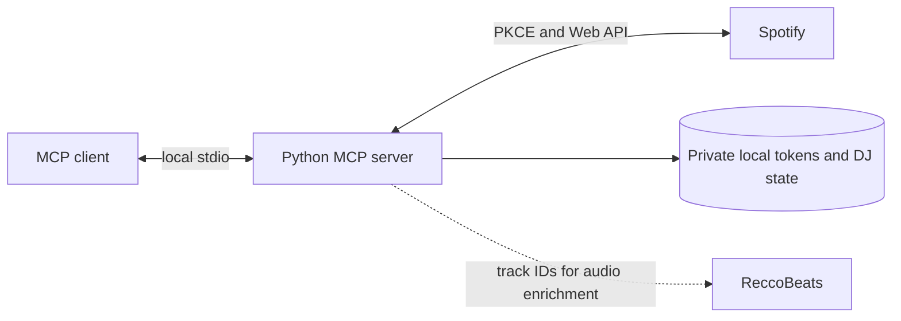

<div align="center">

# MCP tools for Spotify

**Search your library, control playback, curate playlists, and plan DJ sets from an MCP client.**

[](https://www.python.org/)
[](https://github.com/modelcontextprotocol/python-sdk)
[](#how-data-moves)
[](LICENSE)

[Quick start](#quick-start) · [Codex plugin](#use-it-from-codex) · [Tool catalog](docs/tools.md) · [Safety](#safety-by-default)

</div>

> [!IMPORTANT]
> This is an independent open-source project and is not affiliated with or endorsed by Spotify.
> Your use must comply with the [Spotify Developer Policy](https://developer.spotify.com/policy),
> including its attribution, data-handling, and AI/ML restrictions.

The server is written in Python on the official MCP SDK v2. It uses Spotify Authorization Code with
PKCE, keeps tokens outside the repository, and does not require a client secret.

## Why use it

| Workflow | What it provides |
| --- | --- |
| Discover and rediscover | Search music and podcasts, follow canonical Spotify links, and get explicitly local, deterministic taste suggestions across more than the newest Liked Songs page. |
| Curate safely | Create and edit playlists with exact Spotify IDs or URIs and explicit verified, mismatched, or ambiguous mutation states. |
| Work with audio evidence | Compare Spotify and ReccoBeats measurements while retaining field-level provenance, overrides, and conflicts. |
| Plan DJ running orders | Analyze playlists, preview deterministic plans, verify snapshots before mutation, and retain local restore receipts. |

See the [complete tool catalog](docs/tools.md) for inputs, outputs, limits, and mutation behavior.

## Quick start

### Requirements

| Requirement | Notes |
| --- | --- |
| Python | 3.11 or newer |
| Package runner | [uv](https://docs.astral.sh/uv/) |
| Local tools | Git, Make, and Bash on macOS or Linux |
| Spotify | A Spotify Web API application and its client ID |

### 1. Install and configure

```bash
git clone https://github.com/martin-gomola/spotify-mcp.git
cd spotify-mcp
cp .env.example .env
```

Add your client ID to `.env`:

```dotenv
SPOTIFY_CLIENT_ID=your_client_id
```

In the [Spotify Developer Dashboard](https://developer.spotify.com/dashboard), register this exact
redirect URI:

```text
http://127.0.0.1:8888/callback
```

Use the literal IP address, not `localhost`.

### 2. Choose how to run it

For Codex, one command connects Spotify, verifies access, and installs or refreshes the plugin:

```bash
make codex-install
```

Start a new Codex task afterward. Codex starts and stops the local server itself, so no Spotify
terminal needs to remain open.

For another MCP client or manual development, complete setup and start the foreground stdio server:

```bash
make setup
make run
```

The first setup opens Spotify's browser authorization flow, stores the private renewable token, and
verifies live access. The open `make run` terminal owns the manual server process; stop it with
<kbd>Ctrl</kbd>+<kbd>C</kbd>.

> [!NOTE]
> Spotify Connect playback needs an available device. Spotify Development Mode restrictions also
> apply; read the [setup guide](docs/setup.md#spotify-development-mode) before sharing access.

## Use it from Codex

The public plugin currently runs this checkout. It defaults to `~/dev/spotify-mcp`; set
`SPOTIFY_MCP_REPO` before starting Codex if you keep the repository elsewhere. `make codex-install`
is safe to repeat and prints the loaded plugin version.

Example requests:

- “Build a road-trip playlist from across my Liked Songs history.”
- “Audit my Liked Songs without changing anything.”
- “What is playing, and what is next in my queue?”
- “Find podcasts about road trips and show the best episodes as clickable cards.”
- “Rediscover 20 tracks from my taste signals, clearly separated from Spotify recommendations.”
- “Plan a DJ running order that peaks late, but do not apply it.”

<details>
<summary><strong>Update, verify, or remove the plugin</strong></summary>

Refresh the marketplace, confirm the loaded version, and start a new Codex task:

```bash
make codex-update
```

Manual installation uses the same two Codex commands:

```bash
codex plugin marketplace add martin-gomola/spotify-mcp --ref main
codex plugin add spotify-mcp@spotify-mcp
```

Remove the plugin and marketplace when you no longer want them:

```bash
codex plugin remove spotify-mcp@spotify-mcp
codex plugin marketplace remove spotify-mcp
```

</details>

## How data moves



- Spotify OAuth tokens and DJ artifacts are stored in OS-appropriate private data directories, not
  in the checkout.
- ReccoBeats is used by audio and DJ workflows. With `source=auto`, exact track IDs may be sent to
  ReccoBeats when Spotify data is unavailable or incomplete.
- The streamable HTTP transport is intentionally restricted to a loopback address and does not add
  MCP authentication. Stdio is the default.

## Personal audio uploads

Spotify's official [Save to Spotify](https://github.com/spotify/save-to-spotify) CLI can turn your
own text or audio into personal Spotify content. Install and authenticate it separately when you
need that workflow; it uses a distinct Spotify authorization grant, scopes, token store, release
cycle, and Apache-2.0 license. Spotify MCP does not bundle it, share its tokens, or send Spotify
content to it automatically.

## Safety by default

| Risk | Guardrail |
| --- | --- |
| Uncertain writes | A write is never blindly retried after it might have reached Spotify. The result is reported as ambiguous and requires a fresh read. |
| Concurrent playlist edits | Playlist mutations verify Spotify snapshots before changing order. |
| Destructive operations | Liked Songs removal and playlist removal or unfollow operations are marked destructive in MCP metadata. |
| DJ changes | Apply and restore default to `dry_run=true` and record local mutation receipts. |
| Credential exposure | PKCE removes the client-secret requirement; saved tokens stay outside the repository with owner-only permissions. |

## Documentation

| Guide | Use it for |
| --- | --- |
| [Setup and authentication](docs/setup.md) | Spotify application setup, PKCE, Codex configuration, and troubleshooting |
| [Tool catalog](docs/tools.md) | Exact tool inputs, outputs, safety states, and limitations |
| [Architecture](docs/architecture.md) | Runtime boundaries, adapters, persistence, and safety invariants |
| [Framework decision](docs/framework-decision.md) | Why the project uses the official MCP Python SDK |
| [Development](docs/development.md) | Repository layout, local checks, and contribution workflow |
| [Security policy](SECURITY.md) | Credential handling and responsible vulnerability reporting |

## Development

Run the complete local release gate before opening a pull request:

```bash
make check
```

It runs Ruff formatting and lint checks, strict mypy, the test suite, repository-owned release
contract checks, and source and wheel builds.

## License and trademarks

The source code is available under the [MIT License](LICENSE).

Spotify is a trademark of Spotify AB. This project is independently developed and is not affiliated
with, sponsored by, or endorsed by Spotify AB.
